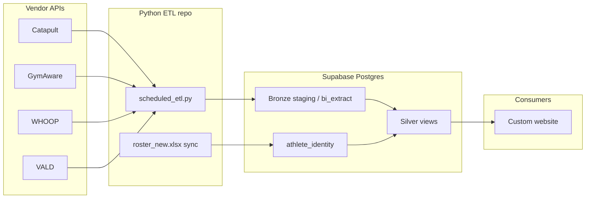

# System design — Volleyball data platform

Design document for capstone handover: core functionality, workflows, assumptions, and significant decisions.

## 1. Purpose

Ingest multi-vendor athlete performance data (Catapult, GymAware, WHOOP, VALD), normalize identity via a coach-maintained roster, store in **Supabase Postgres**, and expose **deduplicated silver views** for a custom analytics website (and optional BI tools).

## 2. Architecture (high level)

## 3. Layer model (medallion)

| Layer | Objects | Behaviour |
|-------|---------|-----------|
| **Bronze** | `*_staging`, `*_bi_extract` | Append-only; each ETL run inserts new rows with `ingest_id` / `etl_ingested_at`. |
| **Silver** | `silver_*` views | Dedupe to business grain; attach `athlete_internal_key`, `athlete_display_name`. |
| **Gold** | Catapult daily rollup | **Deferred** — client requires session-level Catapult, not one row per athlete per day. |

## 4. Core workflows

### 4.1 Nightly automated ETL

1. GitHub Actions (or Task Scheduler) runs `scheduled_etl.py --all`.
2. Sync `roster_new.xlsx` → `athlete_identity` + `roster_cohort`.
3. Export each vendor → upload to staging/BI tables.
4. WHOOP: refresh OAuth tokens, pull sleep/workout/cycle/recovery.
5. Catapult load index → JSON + `catapult_load_index_*` tables.

### 4.2 Coach roster update

1. Coach edits `data/roster/roster_new.xlsx` (WHOOP ID, vendor IDs, names).
2. Commit/push or local run triggers sync scripts.
3. Next ETL applies `ROSTER_FILTER=1` so only cohort athletes are ingested.

### 4.3 WHOOP OAuth (per athlete)

1. Athlete opens Auth Bridge `/whoop/start?state=<internal_key>`.
2. Callback stores refresh token in `whoop_oauth_token`.
3. `whoop_etl.py` uses stored tokens on schedule.

### 4.4 Website read path (VPA)

1. **VPA** (separate `Volleyball_Performance_Analysis` repo): React UI → FastAPI → PostgREST on **silver** tables (service role server-side only).
2. User selects athlete + date range (or opens `/readiness` for team view).
3. Routers filter by `athlete_internal_key` + `calendar_date` (or aggregate client-side on Readiness until a summary API exists).
4. Deep links: `?athlete=` + `?day=YYYY-MM-DD` on Catapult / GymAware / WHOOP from Readiness expand rows.
5. No single wide merged table — star pattern around `athlete_identity`.
6. Feature list and APIs: `docs/operations/vpa_application_updates.md`.

## 5. Significant design decisions

| Decision | Rationale |
|----------|-----------|
| Append-only bronze | Audit trail; simpler ETL (no upsert conflicts on JSON payloads). |
| Silver as SQL views | Dedup logic in DB; website always sees current rules without re-export. |
| Session-level Catapult silver | Client rejected daily Gold rollup; multiple sessions same day = multiple rows. |
| Roster workbook in Git | Coaches do not edit `.env`; CI uses same cohort as production. |
| `gymaware_athlete_reference` as BIGINT | Integer overflow on large GymAware IDs. |
| Correlation by athlete + date, not row count | WHOOP/GymAware/Catapult grains differ by design. |

## 6. Assumptions

- Supabase project and API credentials are provisioned by the client/team.
- Athletes with WHOOP data have completed OAuth and have `whoop_user_id` in roster.
- Catapult API token remains valid; rate limits may require tuning under bulk export.
- Frontend team implements UI; data team delivers schema + ETL + documentation.

## 7. External libraries

See `requirements.txt`. Key dependencies: `requests`, `psycopg2`, `pandas` (roster sync), `fastapi`/`uvicorn` (WHOOP bridge), `openpyxl` (roster xlsx). Attribution: vendor API docs (Catapult Connect, GymAware Cloud, WHOOP Developer, VALD).

## 8. Security notes

- Secrets in `.env` / GitHub Actions secrets only.
- `whoop_oauth_token` and PII tables need RLS before public anon key access.
- Service role `DATABASE_URL` must not ship to browser.

## 9. Related documents

- `docs/operations/runbook.md` — operations
- `docs/operations/vpa_application_updates.md` — VPA routes, APIs, June 2026 features
- `docs/operations/vpa_frontend_integration.md` — two-repo integration
- `docs/volley-etl/cross_source_correlation.md` — multi-source joins
- `docs/data_dictionary_baseline.md` — tables and columns
- `docs/operations/testing_notes.md` — verification and debugging
