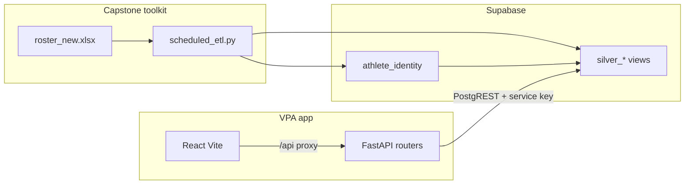

# VPA frontend integration (FastAPI + React)

The **Volleyball Performance Analytics (VPA)** app is a separate repository (`vpa/`) built by the frontend team. This **Capstone-team54-volleyball-toolkit** repo supplies the data: nightly ETL → Supabase bronze → **silver views** that VPA reads via PostgREST.

## Two repos, two backends

| Repo | Backend | Role |
|------|---------|------|
| **This toolkit** | `backend/app.py` (optional) | WHOOP **OAuth only** — athletes link accounts; tokens stored in `whoop_oauth_token` |
| **VPA** | `vpa/backend/app/main.py` | **Dashboard API** — reads silver tables with `SUPABASE_SERVICE_KEY`; never expose that key in the browser |

Do not confuse the two FastAPI apps. ETL and WHOOP auth live here; coaching UI lives in VPA.

## Architecture



## Silver tables VPA uses (confirmed contract)

| Table | VPA usage | ETL source |
|-------|-----------|------------|
| `silver_catapult_session` | Main dashboard, `/catapult` session log (load, distance, BMP when joined), `/readiness` | `schema/silver_catapult_session.sql` |
| `silver_catapult_jump_session` | Dashboard **daily-jumps**, radar volume/intensity, triad jump panel, `/catapult` session BMP fields | `schema/silver_catapult_jump_session.sql` + BMP ETL |
| `silver_whoop_recovery` | Main dashboard, `/whoop`, `/readiness` | `schema/silver_whoop.sql` |
| `silver_whoop_sleep` | `/whoop` sleep breakdown | `schema/silver_whoop.sql` |
| `silver_whoop_sleep_longest_per_day` | Triad deep-sleep panel (`total_slow_wave_sleep_time_milli`) | `schema/silver_whoop.sql` |
| `silver_whoop_workout` | `/whoop`, `/readiness` | `schema/silver_whoop.sql` |
| `silver_gymaware_summaries` | `/gymaware`, load–velocity analysis, `/readiness` | `schema/silver_gymaware.sql` |
| `silver_gymaware_bests` | `/gymaware` PB, load–velocity PB benchmark | `schema/silver_gymaware.sql` |

**Application changelog (pages, new endpoints, handoff):** [`vpa_application_updates.md`](vpa_application_updates.md)  
**Planned UI (not shipped):** VPA `docs/PLANNED_FEATURES.md` — Readiness vs. Reality matrix and dependencies  
**Local run commands:** [`vpa_local_dev_setup.md`](vpa_local_dev_setup.md)

**Join key:** `athlete_internal_key` (text, e.g. `VB-5406785896`) and `athlete_display_name` — populated when `roster_new.xlsx` is synced to `athlete_identity`.

**Filter pattern:** `athlete_internal_key` + `calendar_date` (same as `docs/volley-etl/cross_source_correlation.md`).

### Columns VPA documents (ensure they exist in Supabase)

**Catapult (stats silver):** `total_player_load`, `player_load_per_minute`, `total_distance`, `field_time`, `jump_event_count`, `high_jump_event_count`, `max_jump_height_cm` (BMP when joined), legacy `high_jump_count_ima_bands_6_8`

**Catapult (jump silver):** `jump_event_count`, `high_jump_event_count`, `max_jump_height_cm`, `max_jump_flight_time_s`, `calendar_date`, `activity_name`

**Toolkit reference:** [`catapult_bmp_jumps_handover.md`](../volley-etl/catapult_bmp_jumps_handover.md)

**WHOOP recovery:** `hrv_rmssd_milli`, `resting_heart_rate`, `recovery_score`, `cycle_strain`, `score_state`

**WHOOP sleep:** `sleep_performance_percentage`, `sleep_efficiency_percentage`, `total_rem_sleep_time_milli`, `total_slow_wave_sleep_time_milli`

**GymAware summaries:** `exercise_name`, `bar_weight`, `mean_velocity`, `peak_velocity`

**GymAware bests:** `exercise_name`, `bar_weight`, `mean_velocity`, `peak_velocity`

If a chart is empty, verify (1) silver SQL applied, (2) ETL has run, (3) roster has vendor IDs for that athlete.

## VPA routes (current)

| Route | Status |
|-------|--------|
| `/` | Main dashboard — KPIs, BMP daily jumps, team snapshot, multi-axis trends; **athlete:** radar, triad, efficiency scatter (see VPA `docs/CHARTS.md`) |
| `/readiness` | Coach readiness table + expandable detail (client-side aggregation) |
| `/gymaware` | Sessions, PB, load–velocity multi-profile + Lmax/Vmax trend |
| `/catapult` | Sessions, charts; `?athlete=` / `?day=` deep links |
| `/whoop` | Recovery, sleep, HRV, workouts; `?day=` filter |
| `/vald` | Tests when data available — depends on staging/silver VALD |
| `/report` | Athlete report page |

## New API (must deploy with GymAware UI)

`GET /api/gymaware/load-velocity-analysis` — params: `athlete_key`, `exercise`, `days` (30–730).  
Backend modules: `app/gymaware_load_velocity.py`, `app/gymaware_exercises.py` (trap-bar alias merge).

## VALD page

VPA has **`/vald` routers and UI**; data depends on VALD ETL in this toolkit. There is still **no `silver_vald_*` view** — queries may hit staging or partial silver depending on VPA implementation. Treat VALD as **data-limited** until silver DDL exists here.

## Optional silver not yet wired in all pages

| View | Use |
|------|-----|
| `silver_whoop_cycle` | Cycle boundaries |
| `silver_whoop_sleep_longest_per_day` | One sleep KPI per day |
| `silver_gymaware_rep` | `GET /gymaware/reps` |
| `athlete_identity` | Athlete list / display names via API |

## Environment setup (both teams)

### Data team (this repo)

- `.env` with `DATABASE_URL` (Postgres) for ETL uploads
- GitHub Actions secrets for nightly `daily_etl.yml`
- WHOOP: `WHOOP_CLIENT_*` for `backend/app.py` + `whoop_etl.py`

### VPA team (`vpa/backend/.env`)

```env
SUPABASE_URL=https://<project-ref>.supabase.co
SUPABASE_SERVICE_KEY=<service-role-secret>
```

Use the **service role** key (server-side only). Same Supabase project as ETL.

### Local full stack

1. Apply `schema/apply_order.txt` in Supabase (including `silver_*.sql`).
2. Run ETL once: `python scheduled_etl.py --all` (or wait for GitHub Actions).
3. VPA backend: `uvicorn app.main:app --reload --port 8000`
4. VPA frontend: `npm run dev` → http://localhost:5173

## Data team checklist when frontend reports issues

| Symptom | Check |
|---------|--------|
| No athletes in selector | `athlete_identity` populated? Roster sync ran? |
| Empty charts | `SELECT COUNT(*) FROM silver_*` — zero rows → ETL or roster IDs |
| Doubled KPIs | VPA must **not** query `*_bi_extract`; use silver only |
| WHOOP blank | OAuth + `whoop_user_id` in roster + `whoop_etl` success |
| 401 from Supabase in VPA | Wrong key (anon vs service role) or URL typo |

## Viva / client messaging

> End-to-end product = **this repo (data)** + **VPA repo (UI)**. Silver tables are the integration contract; both repos target the same Supabase project.

See also: `web_app_handover.md`, `docs/design/system_design.md`.
